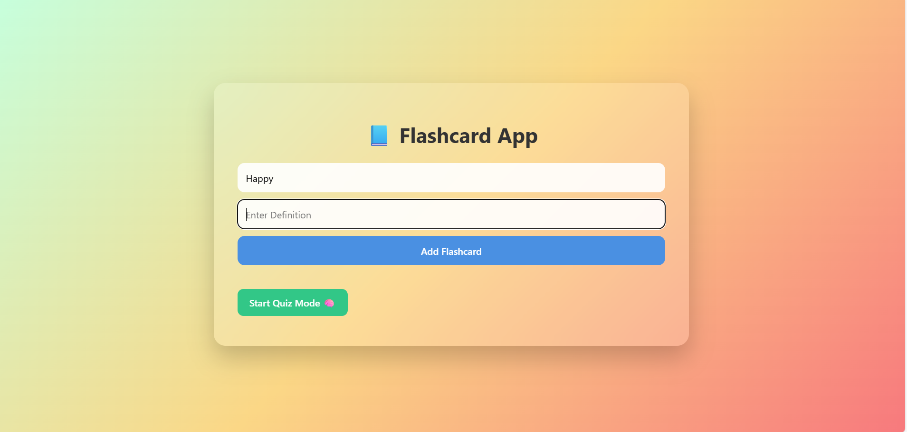

# FlashCard_Project

A sleek and interactive Flashcard Web App built using HTML, CSS, and JavaScript.  
This app allows you to create, view, flip, delete, and quiz yourself on custom flashcards — all in a beautiful UI with localStorage support.


---

## 🚀 Features

### 🔹 Flashcard Creation
- Add new flashcards by entering a **term** and **definition**.
- Cards are saved in **localStorage** (persistent across refreshes).
  
### 🔹 Visual Flashcards Grid
- Cards flip on click to reveal definitions.
- Clean, responsive layout using CSS Flexbox.
- Each card has a **delete (×)** button on the top-right.

### 🔹 Interactive Quiz Mode
- Click "Start Quiz Mode" to review cards one-by-one.
- Try to recall the answer before revealing it.
- Track your progress with a card counter.
- Automatically returns to main view after completion.
- Optional: Exit quiz early with a single click.

---


---

## 🛠️ Tech Stack

- HTML5
- CSS3 (Flexbox, transitions, glassmorphism)
- JavaScript (ES6)
- LocalStorage API

---


---

## 📦 Getting Started

To run this project locally:

```bash
# 1. Clone the repository
git clone https://github.com/your-username/flashcard-app.git

# 2. Open the folder
cd flashcard-app

# 3. Open index.html in your browser

💡 Future Enhancements (Ideas)
 Export/Import flashcards as JSON or CSV

 Dark Mode toggle

 Flashcard categories/tags

 Score tracking in quiz mode

 User authentication + cloud sync (Firebase)

 PWA support (Installable App)

